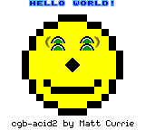
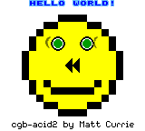
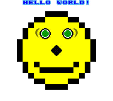
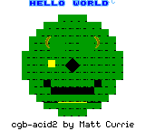
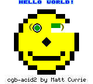

# cgb-acid2
cgb-acid2 is a test for developers of Game Boy Color emulators to verify their
emulation of the Game Boy Color's Pixel Processing Unit (PPU).

[Download the ROM](https://github.com/mattcurrie/cgb-acid2/releases/download/v1.1/cgb-acid2.gbc),
or build using [RGBDS](https://github.com/rednex/rgbds):

```
git clone --recurse-submodules https://github.com/mattcurrie/cgb-acid2
cd cgb-acid2 && make
```

## Reference Image
An accurate emulator should generate output identical to the image below:


If you want to automate testing using the reference image, you should use this
formula to convert each 5-bit CGB palette component to 8-bit: 
`(r << 3) | (r >> 2)`

[Reference photo from a real device](https://github.com/mattcurrie/cgb-acid2/raw/master/img/photo.jpg)

## Emulator Requirements
A simple line based renderer is sufficient to generate the correct output. This
is NOT a [PPU timing torture test requiring T-cycle accuracy](https://github.com/mattcurrie/mealybug-tearoom-tests), and does NOT perform register writes during the PPU's mode 3.

The test uses LY=LYC coincidence interrupts to perform register writes on 
specific rows of the screen during mode 2 (OAM scan).

Double speed mode and WRAM banking emulation are not required.

## Guide
See the table below for examples of incorrect behaviour and the corresponding
attribute/flag.

| Failure Example | Functionality Tested |
| --------------- | ---------------------|
| | Background Tile VRAM Bank (bit 3) |  
|  | Background Tile Horizontal Flip (bit 5) |
|  | Background Tile Vertical Flip (bit 6) |
|  | Background to OAM Priority (bit 7) |
|  | Object Tile Data VRAM Bank (bit 3) |
|  | Object Horizontal Flip (bit 5) |
|  | Object Vertical Flip (bit 6) |
|  | Object to Background Priority (bit 7) |
|  | Master Priority (bit 0) |
|  | Object Enable (bit 1) |
|  | Object Size (bit 2) |
|  | Background Tile Map (bit 3) |
|  | Background/Window Tile Data (bit 4) |
|  | Window Enable (bit 5) |
|  | Window Tile Map (bit 6) |
|  | Object Priority Mode (DMG/CGB) |
|  | 10 Object Limit |

## Credits
Håkon Wium Lie and Ian Hickson for creation of the original 
[Acid2](http://www.acidtests.org/) web standards compliance test.
