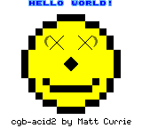
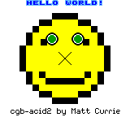
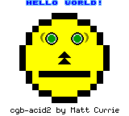
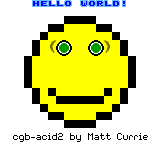
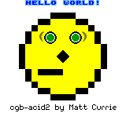
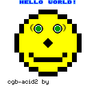
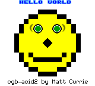
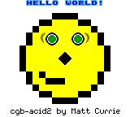

# cgb-acid2
cgb-acid2 is a test for developers of Game Boy Color emulators to verify their
emulation of the Game Boy Color's Pixel Processing Unit (PPU).

[Download the ROM](https://github.com/mattcurrie/cgb-acid2/releases/download/v1.1/cgb-acid2.gbc),
or build using [RGBDS](https://github.com/rednex/rgbds):

```
git clone --recurse-submodules https://github.com/mattcurrie/cgb-acid2
cd cgb-acid2 && make
```

## Reference Image
An accurate emulator should generate output identical to the image below:


If you want to automate testing using the reference image, you should use this
formula to convert each 5-bit CGB palette component to 8-bit: 
`(r << 3) | (r >> 2)`

[Reference photo from a real device](https://github.com/mattcurrie/cgb-acid2/raw/master/img/photo.jpg)

## Emulator Requirements
A simple line based renderer is sufficient to generate the correct output. This
is NOT a [PPU timing torture test requiring T-cycle accuracy](https://github.com/mattcurrie/mealybug-tearoom-tests),
and does NOT perform register writes during the PPU's mode 3.

The test uses LY=LYC coincidence interrupts to perform register writes on
specific rows of the screen during mode 2 (OAM scan).

Double speed mode and WRAM banking emulation are not required.

## Guide

### Hello World!
The "Hello World" text is constructed from 10 objects, and the exclaimation
mark is part of the background. There is also an additional solid white object
where the exclaimation mark is. Due to the 10 object per line limit, the solid
white object should not be drawn, allowing the background to show through.

### Eyes
The eyes consist of four background/window tiles using the same tile data that
is flipped vertically and/or horizontally. The top left corner of the eye
contains the unflipped tile. 

The left eye is drawn using the background, and the right eye is drawn using
the window (and also the right edge of the head beside the right eye). At the
bottom of the eye, the WX register is set to an off-screen value, so the window
is hidden until the WX register is set again for drawing the right side of the
chin.

The background/window tiles for the top left corner of both eyes use red for
color 0. A green object is positioned overlapping it with OBJ-to-BG Priority
(bit 7) set in the OAM flags, so the green object only shows through color 0 of
the background/window tile and replaces the red color.

The background/window tiles for the top right corner of both eye use red for
color 0 with BG-to-OAM Priority (bit 7) set in the background map attributes. A
green object is positioned overlapping it, so the green object only shows
through color 0 of the background tile and replaces the red color.

### Nose
The nose consists of four objects using the same tile data that is flipped
vertically and/or horizontally. The top left corner of the nose contains the
unflipped tile. The tile data comes from VRAM bank 1.

The background tiles behind the nose have BG-to-OAM Priority (bit 7) set in the
background map attributes, however for this section of the screen the Master
Priority (bit 0) of LCDC has been reset, so the objects are always on top
regardless of the background map attribute setting.

### Mole
The mole is not visible in the reference image, but can be seen in the failure
case image for Object Priority Mode (DMG/CGB).

This part of the test consists of two overlapping objects: a blank yellow
square, and a black dot/"mole". The blank yellow square object OAM entry is
before the mole, so effectively covers the mole even though the mole object has
a lower X coordinate.

### Mouth
The mouth consists of eight 8x16 objects. The left and right edges of the mouth
contain unflipped tile data, and other objects use vertically flipped tile
data.

For the left side of the mouth, the objects specify tile index 6, and the right
side of the mouth specify tile index 7. Because bit 0 of the tile index is
ignored for 8x16 objects, the whole mouth effectively uses tile index 6.

### Chin
The right side of the chin is drawn using the window. After the right eye was
drawn, the window was hidden by setting WX to an off-screen value. For the
right side of the chin, the WX value is restored to an on-screen value. After
the chin has been drawn, the window is disabled using bit 5 of the LCDC
register so the window does not cover the footer text.

For the right side of the chin, the window has been updated to use the tile map
from the VRAM beginning at $9800.  Because 16 rows of window have already been
drawn for the eye, the right side of the chin is rendered starting from address
$9840.

### Footer Text
For the footer text, the background is set to use the $9c00-9fff region for
the map data, and tile data is set to come from the $8800-97ff region.

## Failure Examples
See the table below for some examples of incorrect behaviour and the
corresponding attribute/flag. This is not intended to be an exhaustive list of
all possible failures.

| Failure Example | Functionality Tested |
| --------------- | ---------------------|
| | Background Tile VRAM Bank (bit 3) |  
|  | Background Tile Horizontal Flip (bit 5) |
|  | Background Tile Vertical Flip (bit 6) |
|  | Background to OAM Priority (bit 7) |
|  | Object Tile Data VRAM Bank (bit 3) |
|  | Object Horizontal Flip (bit 5) |
|  | Object Vertical Flip (bit 6) |
|  | Object to Background Priority (bit 7) |
|  | Master Priority (bit 0) |
|  | Object Enable (bit 1) |
|  | Object Size (bit 2) |
|  | Background Tile Map (bit 3) |
|  | Background/Window Tile Data (bit 4) |
|  | Window Enable (bit 5) |
|  | Window Tile Map (bit 6) |
|  | Object Priority Mode (DMG/CGB) |
|  | 10 object per line limit |
|  | Bit 0 of tile index for 8x16 objects should be ignored |

## Credits
Håkon Wium Lie and Ian Hickson for creation of the original 
[Acid2](http://www.acidtests.org/) web standards compliance test.
